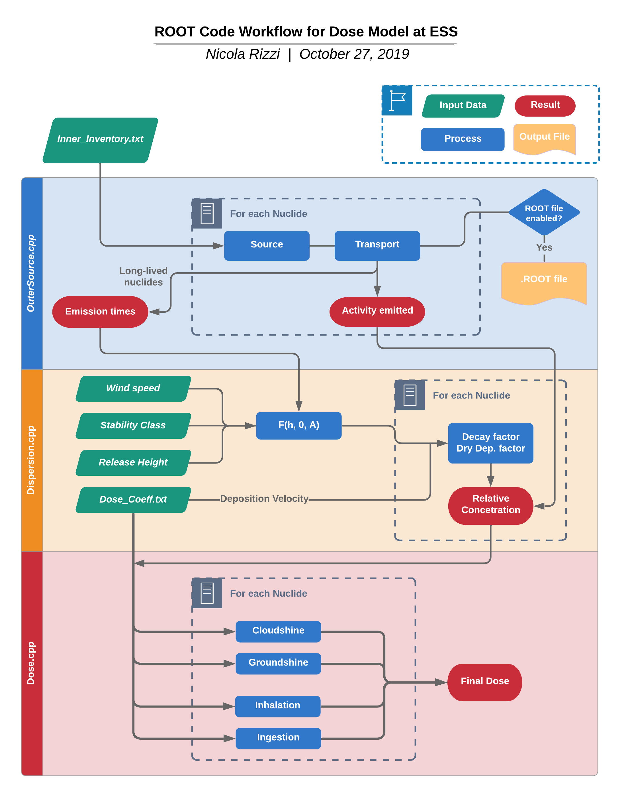

# dose-model-root
Dose Model for Accident Scenarios

Choose:
* Simple dose evaluation with default values -> Folder with just the name
* Monte Carlo dose distribution for LP102-PIE1 -> Folder MonteCarlo
* Sensitivity study for LP102-PIE1 -> Folder Sensitivity Study

then

`$ source execute_me.sh` 
